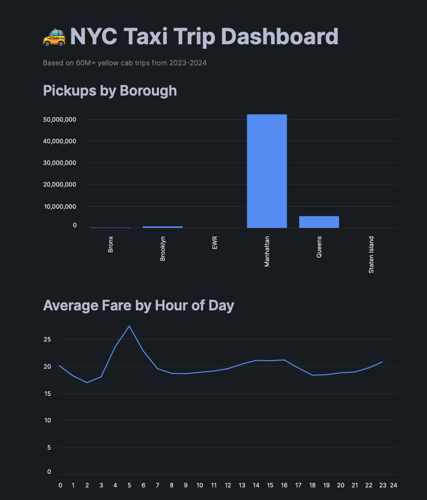
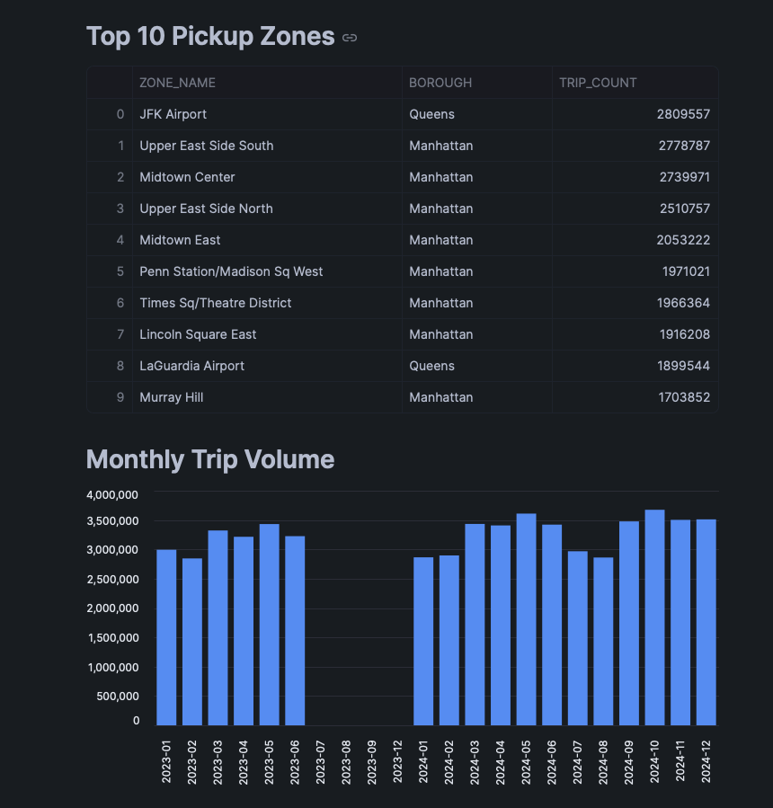
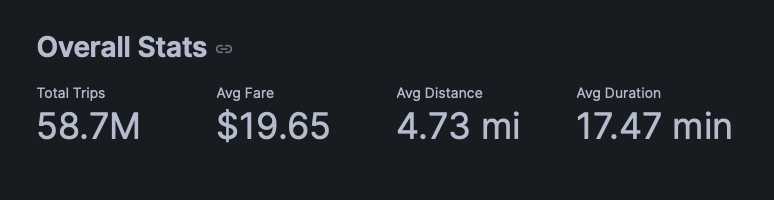

# NYC Taxi ELT Pipeline

End-to-end ELT pipeline processing 60M+ NYC TLC yellow cab trips (2023-2024).

## Architecture
- **Ingestion:** Python + Snowflake connector loads monthly Parquet files into Snowflake raw schema
- **Transformation:** dbt Core with staging → marts layers (fact_trips, dim_zones, dim_time)
- **Data Quality:** 16 dbt tests (uniqueness, not-null, referential integrity, custom business logic)
- **CI/CD:** GitHub Actions runs dbt build on every commit with Discord webhook alerting
- **IaC:** Terraform provisions all Snowflake infrastructure (warehouse, database, schemas, roles, users)
- **Dashboard:** Streamlit in Snowflake visualizing trip patterns across 60M+ rows

## Stack
Snowflake · dbt Core · Python · Terraform · GitHub Actions · Discord · Streamlit

## Dashboard

